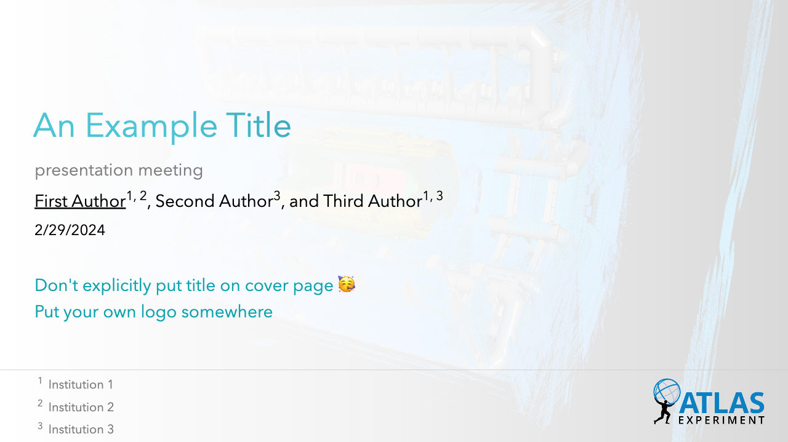
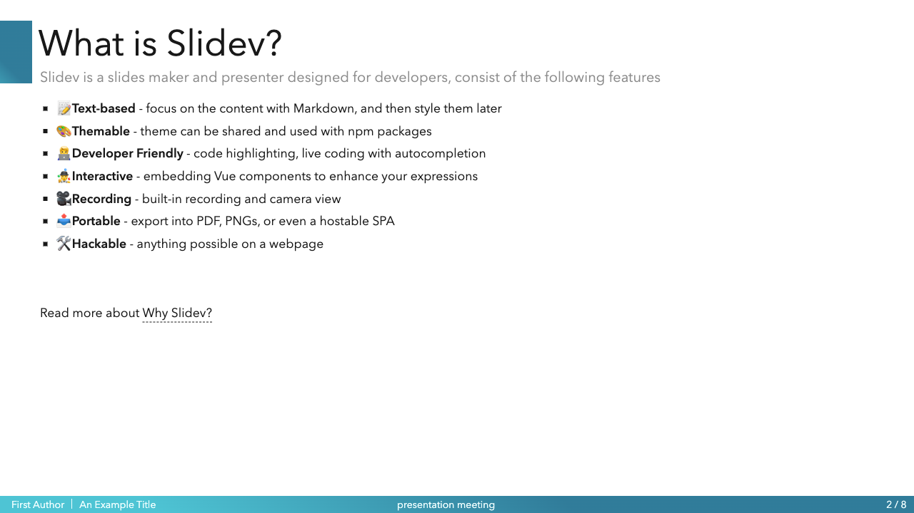

# slidev-theme-hep

[](https://github.com/AvencastF/slidev-theme-hep/pkgs/npm/slidev-theme-hep)

An academic theme for High Energy Physics (HEP) for [Slidev](https://github.com/slidevjs/slidev). 

## ❤️‍🔥 Demo

### [link](https://avencastf.github.io/slidev-theme-hep/)


## 🛠 Install

Add the following frontmatter to your `slides.md`. Start Slidev then it will prompt you to install the theme automatically.

<pre><code>---
theme: <b>hep</b>
---</code></pre>

Learn more about [how to use a theme](https://sli.dev/themes/use).

## 💼 Layouts

This theme provides the following layouts:


### Cover



| **Parameter** | **Type**                          | **Default**                       | **Notes**                                              |
| ------------- | --------------------------------- | --------------------------------- | ------------------------------------------------------ |
| `background`  | `string`                          | `'ATLAS/ATLAS-Detector.png'`      |                                                        |
| `authors`     | `[authorName: string]: string[];` | `{}`                              | See examples below                                     |
| `meeting`     | `string`                          | `''` (empty string)               | Meeting of this presentation                           |
| `preTitle`    | `string`                          | `'An Example Title'`              | Title of the presentation                              |
| `preDate`     | `string`                          | `new Date().toLocaleDateString()` | Automatically generated as the current localized date. |


The authors and the corresponding affiliation can be configured as below:
```yaml
authors:  # First author should be the presenter
  - First Author: ["Institution 1", "Institution 2"] 
  - Second Author: ["Institution 3"]
  - Third Author: ["Institution 1", "Institution 3"] 
```
<span style="color: red;">**Note that the first author should be the presenter.** </span>

---

### pageBar



This is the layout with a bottom bar and a decorative box left to the title,
trying to give a structured approach to displaying slide information consistently across the presentation..
The key parts of this layout are: 
- **Title Bar at Bottom:** At the bottom of the slide, there's a horizontal bar (a component named `BarBottom`) that contains the following information:
  - A title (`title`), which displays the title of the presentation pulled from the configuration. 
  - An author name (`author`), which suggests that it is showing the first author's name from a list of authors defined in the configuration.
  - A meeting or event name (`meeting`), which is also taken from the configuration settings.
- **Page Number:**
   - In the bottom-right corner, there is an automatic slide number indicator. 

---

## 🗿 Components

This theme provides the following components:

### `TextBox`

The Text Box component is a flexible Vue component designed to display text content within a styled container. 
The component is absolutely positioned within its parent and can be customized with various styles and labels such as 'info' and 'warning'. 
The text content supports automatic conversion of newline characters to HTML line breaks for better readability.

#### Props
The component accepts the following props:
| Prop           | Type   | Default                                                    | Description                                              |
| -------------- | ------ | ---------------------------------------------------------- | -------------------------------------------------------- |
| `text`         | String | None                                                       | The text content to be displayed within the text box.    |
| `position`     | Object | `{ top: '0px', left: '0px', right: '0px', bottom: '0px' }` | The absolute position of the text box within its parent. |
| `customStyles` | Object | None                                                       | Additional custom CSS styles for the text box container. |
| `label`        | String | `'info'`                                                   | A label that determines the styling of the text content. |
#### Styling
The component has scoped CSS with the following predefined classes:
| Class Name           | Description                                               | Style Properties                                                                       |
| -------------------- | --------------------------------------------------------- | -------------------------------------------------------------------------------------- |
| `text-box-container` | The container of the text box, centered and flex-aligned. | `display: flex; flex-direction: column; justify-content: center; align-items: center;` |
| `text-content`       | The actual content of the text box.                       | `padding: 0.5rem;`                                                                     |
| `warning`            | Style for warning label.                                  | `background-color: #ffcc00; color: red;`                                               |
| `info`               | Style for info label.                                     | `background-color: transparent; color: #0FA3B1; font-weight: 550; font-size: 1.5em;`   |

The `customStyles` prop allows for further customization beyond these preset classes. Users can pass an object with any CSS properties they wish to apply to the `.text-box-container`.

Example usage:

```html
<Text-Box
  text="This is an info message with\nmultiple lines."
  :position="{ top: '20px', left: '20px' }"
  label="info"
/>
<Text-Box
  text="This is a warning message!"
  :customStyles="{ fontSize: '1em', fontWeight: 'bold' }"
  label="warning"
/>
```

### `PlotlyGraph`

The `PlotlyGraph` component is a Vue wrapper for Plotly.js, allowing for easy embedding and manipulation of Plotly graphs within your Vue application. The component accepts various props to customize the graph's dimensions and font sizes.

#### Props

The component accepts the following props for configuration:

| Prop                      | Type   | Description                                                     |
| ------------------------- | ------ | --------------------------------------------------------------- |
| `filePath`                | String | The URL or path to the configuration file for the Plotly graph. |
| `graphWidth`              | Number | The width of the graph in pixels.                               |
| `graphHeight`             | Number | The height of the graph in pixels.                              |
| `xTitleFontSize`          | Number | The font size for the x-axis title.                             |
| `yTitleFontSize`          | Number | The font size for the y-axis title.                             |
| `tickFontSize`            | Number | The font size for the tick labels on both axes.                 |
| `annotationFontSizeScale` | Number | A scale factor to adjust the font size of annotations.          |

#### Usage

To use the `PlotlyGraph` component, you must provide the `filePath` prop with a valid URL or path to a Plotly configuration file. 
Other props are optional and allow you to customize the appearance of the graph.

**It's highly recommended to produce the JSON file for plotting by [Plotly](https://plotly.com/python/) in Python.**

#### Example

```html
<PlotlyGraph
  filePath="path/to/plotly/config.json"
  graphWidth="600"
  graphHeight="400"
  xTitleFontSize="14"
  yTitleFontSize="14"
  tickFontSize="12"
  annotationFontSizeScale="1.5"
/>
```

---


## Contributing

- `npm install`
- `npm run dev` to start theme preview of `example.md`
- Edit the `example.md` and style to see the changes
- `npm run export` to generate the preview PDF
- `npm run screenshot` to generate the preview PNG
